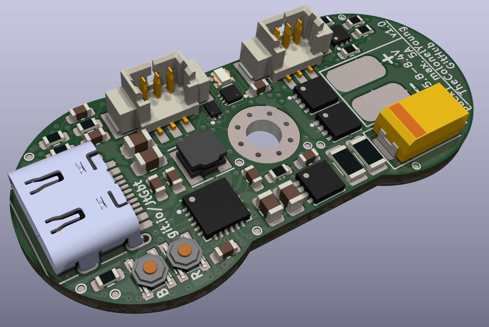
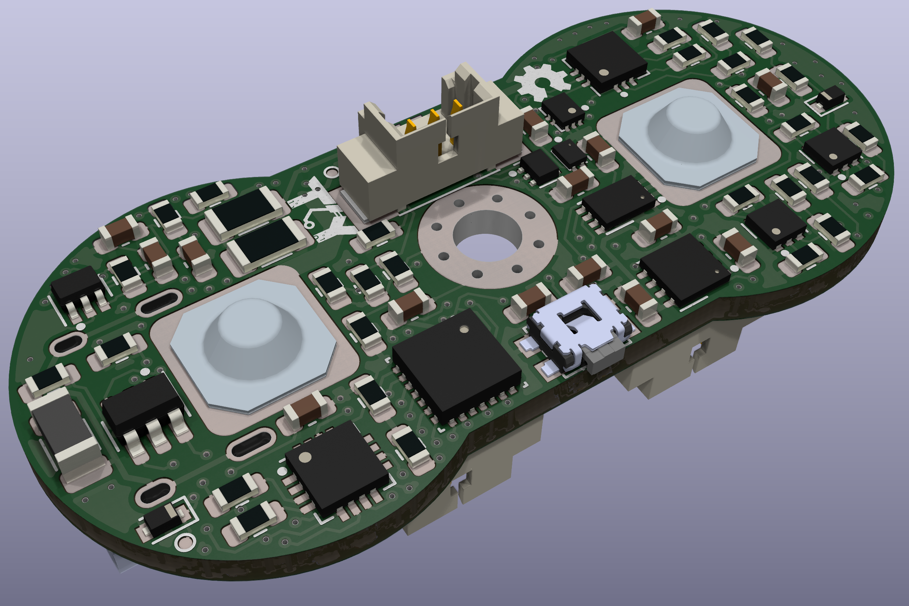

# Kratos pack
Battery case with electronics for charging and protection of battery cells. Composes of 2s li-ion 3,7V battery cells. Includes undervoltage, overvoltage and overcurrent protection. As well as reverse voltage protection. Is charged from USB type-C connector. Support statistics over USB and have battery voltage indication via RGB LED.

 Front | Back |
-------------------------|-------------------------|
 | 

PCB is placed on top of batteries, so contact on bottom of board touch positive side of one battery and negative of other.
On other side batteries are connected only with metal bridge with spring contact to which is soldered cable which leads to connector on board. This wire is used to read voltage of individual batteries and balance then during charging.
